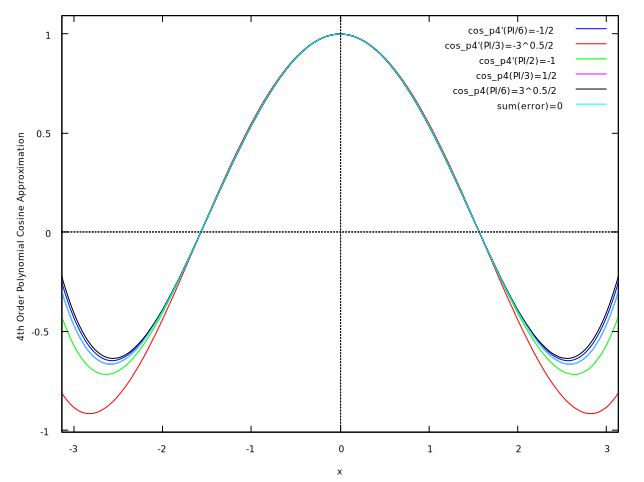
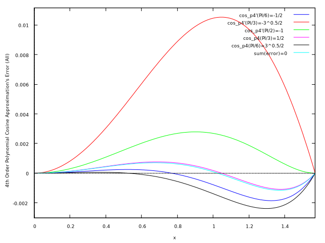
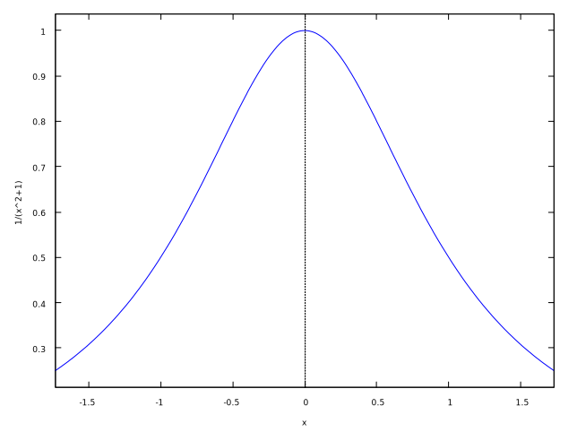
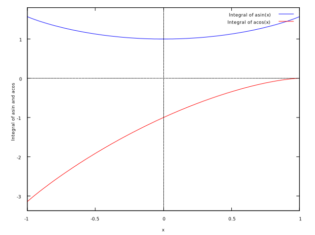

# Internal implementation of special function approximation 特殊関数の近似の内部実装

## 序文

Intar では､ [解析関数](https://ja.wikipedia.org/wiki/%E8%A7%A3%E6%9E%90%E9%96%A2%E6%95%B0) の近似に [テイラー級数](https://ja.wikipedia.org/wiki/%E3%83%86%E3%82%A4%E3%83%A9%E3%83%BC%E5%B1%95%E9%96%8B) (またはマクローリン級数) を使用する｡

このドキュメントは各関数の実行結果がバージョン毎に異なる値にならないように､ その実装の理論的背景を明らかにし､ また､ それを記録するものである｡

Intar は [ローラン級数](https://ja.wikipedia.org/wiki/%E3%83%AD%E3%83%BC%E3%83%A9%E3%83%B3%E7%B4%9A%E6%95%B0) ､ [ピュイズー級数](https://en.wikipedia.org/wiki/Puiseux_series) を使用しない｡ これは､ 除算 (特に非定数による除算)､ 平方根の計算はコストが重く､ 精度よりもパフォーマンス・再現性を重視する Intar の方向性と合わないためである｡

## 正弦 sine と余弦 cosine

以下は sin と cos のグラフ｡

微分と積分は以下の通り｡

$$
\begin{align*}
     sin'(x)     &=  cos(x) \\
     cos'(x)     &= -sin(x) \\
\int sin (x)\ dx &= -cos(x) + C \\
\int cos (x)\ dx &=  sin(x) + C
\end{align*}
$$

sin と cos のテイラー展開は以下の通り｡

$$
\begin{align*}
\sum_{n=0}^\infty \frac{sin^{(n)}(0)}{n!}x^n &= x -
\frac{x^3}{     6} +
\frac{x^5}{   120} -
\frac{x^7}{  5040} +
\frac{x^9}{362880} - ... \\
\sum_{n=0}^\infty \frac{cos^{(n)}(0)}{n!}x^n &= 1 -
\frac{x^2}{    2} +
\frac{x^4}{   24} -
\frac{x^6}{  720} +
\frac{x^8}{40320} - ...
\end{align*}
$$

以下は 4 次の多項式による近似｡

> $$
> 0\le x\le\frac{\pi}{2}
> $$
>
> $$
> cos\ x=1+a_2\ x^2+a_4\ x^4+\epsilon(x)
> $$
>
> $$
> |\epsilon(x)|\le9\times10^{-4}
> $$
>
> $$
> \begin{align*}
> a_2&=-.49670&a_4&=.03705
> \end{align*}
> $$
>
> <cite id="abramowitz-and-stegun-a">Abramowitz and Stegun [\[1\]](#abramowitz-and-stegun) 4. Elementary Transcendental Functions R. Zucker 4.3. Circular Functions 4.3.98</cite>

### 3 次の多項式による近似

3 次の多項式 $sin_{3}$ について考える｡

テイラー展開の結果に基づき､ 以下のように定義する｡

$$
\begin{align*}
sin_{3} \ x &= a_{3\ 1}\ x- a_{3\ 3}\ x^3 \\
sin_{3}'\ x &= a_{3\ 1}   -3a_{3\ 3}\ x^2
\end{align*}
$$

$$
\begin{gather*}
sin_{3} \frac{\pi}{2} = 1 &
sin_{3}'\frac{\pi}{2} = 0
\end{gather*}
$$

$sin_{3}\ x$ が $x=\frac{\pi}{2}$ 付近で滑らかに変化してほしいので $sin_{3}'\frac{\pi}{2}=0$ とする｡

$$
\begin{gather*}
a_{3\ 1} = \frac{3}{\pi  } &
a_{3\ 3} = \frac{4}{\pi^3}
\end{gather*}
$$

| $a_{3\ 1}$ | $a_{3\ 3}$
| :--------- | :---------
| 0.954929658551372 | 0.12900613773279798

| 誤差の符号なし面積 | 誤差の絶対値の最大値
| :--- | :-------------------
| 0.016814472209363194 | 0.02001701341731299

Intar では
1.0 が 2 の 15 乗に､ 直角が
1.0 ($=2^{15}$) に対応するので､ 定数項を以下のように変形する｡

$$
b_{3\ m} = \left(32768 \times \left(\frac{\pi}{2} \right)^m \right) a_{3\ m}
$$

$$
\begin{align*}
b_{3\ 1} &= 49152 & b_{3\ 3} &= 16384
\end{align*}
$$

- 誤差のグラフ : [sin_p3_error.svg](../images/sin_p3_error.svg)
- スクリプト : [sin_p3.wxm](../gists/sin_p3.wxm)

### 4 次の多項式による近似

4 次の多項式 $cos_{4\ p}$ について考える｡

テイラー展開に基づき､ 以下のように定義する｡

$$
\begin{align*}
cos_{4\ p} \ x &= a_{4\ p\ 0}-   a_{4\ p\ 2}\ x^2 +    a_{4\ p\ 4}\ x^4 \\
cos_{4\ p}'\ x &=            -2\ a_{4\ p\ 2}\ x   + 4\ a_{4\ p\ 4}\ x^3
\end{align*}
$$

$$
\begin{gather*}
cos_{4\ p} \ 0             = 1 &
cos_{4\ p} \ \frac{\pi}{2} = 0 &
cos_{4\ p}'\ 0             = 0
\end{gather*}
$$

$$
\begin{gather*}
cos_{4\ 1}'\ \frac{\pi}{6} = -\frac{1}{2} &
cos_{4\ 2}'\ \frac{\pi}{3} = -\frac{\sqrt{3}}{2} &
cos_{4\ 3}'\ \frac{\pi}{2} = -1 \\
cos_{4\ 4} \ \frac{\pi}{3} =  \frac{1}{2} &
cos_{4\ 5} \ \frac{\pi}{6} =  \frac{\sqrt{3}}{2}
\end{gather*}
$$

$$
\int_0^{\frac{\pi}{2}}cos_{4\ 6}\ x-cos\ x\ dx = 0
$$

$a_{4\ p\ 0} = 1$ は自明｡

| p   | $a_{4\ p\ 2}$ | $a_{4\ p\ 4}$
| :-: | :------------ | :------------
| 1 | 0.498087713477496   | 0.03761163067403257
| 2 | 0.4791921675422863  | 0.02995355435513814
| 3 | 0.4922595829549115  | 0.035249578342151415
| 4 | 0.49647379984745516 | 0.03695753611686361
| 5 | 0.4991052271747134  | 0.03802401344273002
| 6 | 0.4966163414241372  | 0.03701530604193427

以下は誤差のグラフ｡

| p   | 誤差の符号なし面積 | 誤差の絶対値の最大値
| :-: | :----------------- | :-------------------
| 1 | $0.0011148909680259859$      | $0.001856752905195394$
| 2 | $0.008517450609043716$       | $0.010528572485006271$
| 3 | $0.0021769446290595446$      | $0.002787073296143406$
| 4 | $7.47827331119593\ 10^{-4}$  | $0.0010902926026138404$
| 5 | $0.0015245811411068449$      | $0.002386297216129152$
| 6 | $7.541190111997224\ 10^{-4}$ | $0.0011532615912570876$

$$
\begin{gather*}
a_{4\ 4\ 2} = \frac{49          }{10\ \pi^2} & a_{4\ 4\ 4} = \frac{18           }{5\ \pi^4} \\
a_{4\ 6\ 2} = \frac{24\ \pi - 60}{    \pi^3} & a_{4\ 6\ 4} = \frac{80\ \pi - 240}{   \pi^5}
\end{gather*}
$$

Intar では整数演算を用いるため､ 0 方向への丸め誤差が無視できないため､
RMSE ､ MAE (誤差の絶対値の平均) ､ ME (誤差の平均) ､
誤差の絶対値の最大値の各々に対して最適化した定数項を求め､
それらが RMSE に対して最適化したそれと大きな差異が無いことを確認した上で､
RMSE に対して最適化した値を採用する｡

以下のように定数項を変形する｡

$$
b_{4\ p\ m} \approx \left(
    32768 \times \left( \frac{\pi}{2} \right)^m
\right) a_{4\ p\ m}
$$

$$
b_{4\ p\ 2} = b_{4\ p\ 4} + 32768
$$

| $b_{4\ p\ 2}$ | $b_{4\ p\ 4}$ | RMSE | MAE | ME | 誤差の最大値
| :------------ | :------------ | :--- | :-- | :- | :-------------------
| 40137 | 7369 | 0.0006023564386931793 | 0.0005158339043712425 | -7.343948279770241e-5   | 0.001090161041422455
| 40162 | 7394 | 0.0006144695912038322 | 0.0005104531440557723 |  2.8285513617763166e-5  | 0.0012286495032944877
| 40109 | 7341 | 0.0006176454570808705 | 0.0005350726783359779 | -0.00018735682010504267 | -0.0009480076555086203

- スクリプト : [cos_p4.wxm](../gists/cos_p4.wxm)
- 誤差の大きな関数を除いた誤差のグラフ : [cos_p4_error.svg](../images/cos_p4_error.svg)

### 5 次の多項式による近似

5 次の多項式 $sin_{5\ p}$ について考える｡

テイラー展開に基づき､ 以下のように定義する｡

$$
\begin{align*}
sin_{5\ p} \ x &= a_{5\ p\ 1}\ x-  \ a_{5\ p\ 3}\ x^3 +  \ a_{5\ p\ 5}\ x^5 \\
sin_{5\ p}'\ x &= a_{5\ p\ 1}   - 3\ a_{5\ p\ 3}\ x^2 + 5\ a_{5\ p\ 5}\ x^4
\end{align*}
$$

$$
\begin{gather*}
sin_{5\ p} \ \frac{\pi}{2} = 1 &
sin_{5\ p}'\ \frac{\pi}{2} = 0
\end{gather*}
$$

$$
\begin{gather*}
sin_{5\ 1}'\ \frac{\pi}{3} = \frac{1}{2} &
sin_{5\ 2}'\ \frac{\pi}{6} = \frac{\sqrt{3}}{2} &
sin_{5\ 3}'\ 0             = 1 \\
sin_{5\ 4} \ \frac{\pi}{6} = \frac{1}{2} &
sin_{5\ 5} \ \frac{\pi}{3} = \frac{\sqrt{3}}{2} &
\end{gather*}
$$

$$
\int_0^{\frac{\pi}{2}}sin_{5\ 6}\ x-sin\ x\ dx = 0
$$

| p   | $a_{5\ p\ 1}$ | $a_{5\ p\ 3}$ | $a_{5\ p\ 5}$
| :-: | :------------ | :------------ | :------------
| 1 | 0.9998721064570402 | 0.16543511387348914 | 0.0073820539629066186
| 2 | 0.9984647301401441 | 0.16429433759942436 | 0.007150884358187937
| 3 | 1.0                | 0.16553878047471238 | 0.007403061208386855
| 4 | 0.9996919862959677 | 0.16528911397014742 | 0.007352468196870118
| 5 | 0.998782232699493  | 0.16455169548040588 | 0.007203035968429407
| 6 | 0.9993139195890486 | 0.16498266464022104 | 0.007290368579201072

以下は誤差のグラフ｡

| p   | 誤差の符号なし面積 | 誤差の絶対値の最大値
| :-: | :----------------- | :-------------------
| 1 | $2.489437523605419  \ 10^{-4}$ | $3.5225713889359793 \ 10^{-4}$
| 2 | $3.7588038591922495 \ 10^{-4}$ | $5.07725290298966   \ 10^{-4}$
| 3 | $2.878854480880034  \ 10^{-4}$ | $3.94534314713129   \ 10^{-4}$
| 4 | $2.011825740487242  \ 10^{-4}$ | $2.960461461023467  \ 10^{-4}$
| 5 | $2.717522212874151  \ 10^{-4}$ | $3.7846876625835524 \ 10^{-4}$
| 6 | $1.5988753941394423 \ 10^{-4}$ | $1.926118628839263  \ 10^{-4}$

$$
\begin{gather*}
a_{5\ 6\ 1} = \frac{48  - 9  \ \pi}{2\ \pi^2} &
a_{5\ 6\ 3} = \frac{192 - 56 \ \pi}{   \pi^4} &
a_{5\ 6\ 5} = \frac{384 - 120\ \pi}{   \pi^6}
\end{gather*}
$$

Intar では定数項を以下のように変形する｡

$$
b_{5\ p\ 1} \approx \left(
    32768 \times \frac{\pi}{2}
\right) \ a_{5\ p\ 1}
$$

$$
\begin{align*}
b_{5\ p\ 3} &= 2\ b_{5\ p\ 1} - 32768 \times \frac{5}{2} \\
b_{5\ p\ 5} &=    b_{5\ p\ 1} - 32768 \times \frac{3}{2}
\end{align*}
$$

4 次の多項式と同様に最適化された値は以下の通り｡

| $b_{5\ p\ 1}$ | $b_{5\ p\ 3}$ | $b_{5\ p\ 5}$ | RMSE | MAE | ME | 誤差の最大値
| :------------ | :------------ | :------------ | :--- | :-- | :- | :-----------
| 51438 | 20956 | 2286 | 0.0001300827165588578 | 0.00011470022837171247 |  0.000015563006660391348 | 0.00023140279033517785
| 51441 | 20962 | 2289 | 0.0001313057048395113 | 0.00011389845600952941 |  0.000030766450879191726 | 0.00024736511684420037
| 51432 | 20944 | 2280 | 0.0001345544988004854 | 0.00011958392710737854 | -0.000015024950479042937 | -0.0002085328271134168

- スクリプト : [sin_p5.wxm](../gists/sin_p5.wxm)

## 逆正接 arctangent

以下は arctan のグラフ

微分と積分は以下の通り｡

$$
arctan'(x)=\frac{1}{x^2+1}
$$

$$
\int arctan(x)\ dx=x\ arctan(x)-\frac{log\left(x^2+1\right)}{2}
$$

以下は $arctan'(x)$ のグラフ｡

以下は $\int arctan(x)\ dx$ のグラフ｡

arctan のテイラー展開は以下の通り｡

$$
\sum_{n=0}^\infty \frac{arctan^{(n)}(0)}{n!}x^n = x -
\frac{x^3}{3} +
\frac{x^5}{5} -
\frac{x^7}{7} +
\frac{x^9}{9} - ...
$$

スクリプト : [atan.wmx](../gists/atan.wmx)

wip

## 逆正弦 arcsine と逆余弦 arccosine

以下は arcsin と arccos のグラフ

微分と積分は以下の通り｡

$$
\begin{align*}
arcsin'(x)&= \frac{1}{\sqrt{1-x^2}} \\
arccos'(x)&=-\frac{1}{\sqrt{1-x^2}}
\end{align*}
$$

$$
\begin{align*}
\int arcsin(x)\ dx&=x\ arcsin(x) + \sqrt{1-x^2} + C \\
\int arccos(x)\ dx&=x\ arccos(x) - \sqrt{1-x^2} + C
\end{align*}
$$

以下は $arcsin'(x)$ と $arccos'(x)$ のグラフ｡

以下は $\int arcsin(x)\ dx$ と $\int arccos(x)\ dx$ のグラフ｡

arcsin と arccos のテイラー展開は以下の通り｡

$$
\begin{align*}
\sum_{n=0}^\infty \frac{arcsin^{(n)}(0)}{n!}x^n &= x +
\frac{  x^3}{   6} +
\frac{ 3x^5}{  40} +
\frac{ 5x^7}{ 112} +
\frac{35x^9}{1152} + ... \\
\sum_{n=0}^\infty \frac{arccos^{(n)}(0)}{n!}x^n &= \frac{\pi}{2} - x -
\frac{  x^3}{   6} -
\frac{ 3x^5}{  40} -
\frac{ 5x^7}{ 112} -
\frac{35x^9}{1152} - ...
\end{align*}
$$

スクリプト : [asin.wmx](../gists/asin.wxm)

wip

## Reference

1. ^ [a](#abramowitz-and-stegun-a) Milton Abramowitz and Irene Stegun . Handbook of Mathematical Function With Formulas, Graphs, and Mathematical Tables (Abramowitz and Stegun) . United States Department of Commerce, National Bureau of Standards (NBS) , 1964

- Another fast fixed-point sine approximation | Coranac
  - http://www.coranac.com/2009/07/sines/
  - http://web.archive.org/web/20240629132053/http://www.coranac.com/2009/07/sines/
