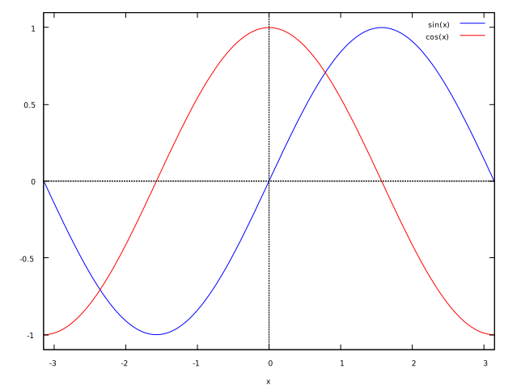
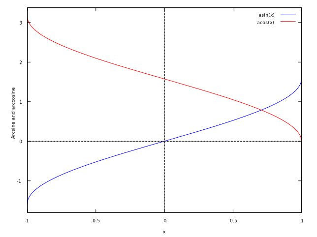

# Internal implementation of special function approximation 特殊関数の近似の内部実装

## 序文

Intar では､ [解析関数](https://ja.wikipedia.org/wiki/%E8%A7%A3%E6%9E%90%E9%96%A2%E6%95%B0) の近似に [テイラー級数](https://ja.wikipedia.org/wiki/%E3%83%86%E3%82%A4%E3%83%A9%E3%83%BC%E5%B1%95%E9%96%8B) (またはマクローリン級数) を使用する｡

このドキュメントは各関数の実行結果がバージョン毎に異なる値にならないように､ その実装の理論的背景を明らかにし､ また､ それを記録するものである｡

Intar は [ローラン級数](https://ja.wikipedia.org/wiki/%E3%83%AD%E3%83%BC%E3%83%A9%E3%83%B3%E7%B4%9A%E6%95%B0) ､ [ピュイズー級数](https://en.wikipedia.org/wiki/Puiseux_series) を使用しない｡ これは､ 除算 (特に非定数による除算)､ 平方根の計算はコストが重く､ 精度よりもパフォーマンス・再現性を重視する Intar の方向性と合わないためである｡

## 正弦 sine と余弦 cosine

以下は sin と cos のグラフ｡

微分と積分は以下の通り｡

$$
\begin{align*}
     sin'(x)     &=  cos(x) \\
     cos'(x)     &= -sin(x) \\
\int sin (x)\ dx &= -cos(x) + C \\
\int cos (x)\ dx &=  sin(x) + C
\end{align*}
$$

テイラー展開は以下の通り｡

> $$
> \begin{gather*}
> sin\ z =z - \frac{z^3}{3!} + \frac{z^5}{5!} - \frac{z^7}{7!} + ... & (|z| < \infty) \\
> \end{gather*}
> $$
>
> <cite>Abramowitz and Stegun [^abramowitz-and-stegun] 4. Elementary Transcendental Functions R. Zucker 4.3. Circular Functions 4.3.65</cite>

> $$
> \begin{gather*}
> cos\ z =1 - \frac{z^2}{2!} + \frac{z^4}{4!} - \frac{z^6}{6!} + ... & (|z| < \infty)
> \end{gather*}
> $$
>
> <cite>Abramowitz and Stegun [^abramowitz-and-stegun] 4. Elementary Transcendental Functions R. Zucker 4.3. Circular Functions 4.3.66</cite>

### 2 次の多項式による近似

$cos\ z$ の近似について以下のように定義する｡

$$
f(x) = 1 - a \times x^2 \\
f(1) = 0
$$

$a = 1$ は自明｡

### 3 次の多項式による近似

$sin\ z$ の近似について以下のように定義する｡

$$
f (x) = a\ x - b\ x ^ 3
$$

$$
\begin{gather*}
f (1) = 1 & f'(1) = 0
\end{gather*}
$$

$f(1) = 1$ より――

$$
\begin{gather*}
a - b = 1 & b = a - 1
\end{gather*}
$$

$f'(1) = 0$ より――

$$
\begin{gather*}
a - 3b = 0 & a = 3b
\end{gather*}
$$

よって――

$$
b = 3b - 1 \\
1 = 2b \\
b = 0.5 \\
a = 1.5
$$

### 4 次の多項式による近似

以下の式に基づいて近似する｡

> $$
> 0\le x\le\frac{\pi}{2}
> $$
>
> $$
> cos\ x=1+a_2\ x^2+a_4\ x^4+\epsilon(x)
> $$
>
> $$
> |\epsilon(x)|\le9\times10^{-4}
> $$
>
> $$
> \begin{gather*}
> a_2 = -0.49670 &
> a_4 =  0.03705
> \end{gather*}
> $$
>
> <cite>Abramowitz and Stegun [^abramowitz-and-stegun] 4. Elementary Transcendental Functions R. Zucker 4.3. Circular Functions 4.3.98</cite>

以下のように定義する｡

$$
0 \le x \le 1
$$

$$
f(x) = 1 - a\ x^2 + b x^4
$$

$$
\begin{gather*}
a = 0.49670 \times \left( \frac{\pi}{2} \right)^2 &
b = 0.03705 \times \left( \frac{\pi}{2} \right)^4
\end{gather*}
$$

### 5 次の多項式による近似

以下の式に基づいて近似する｡

> $$
> 0\le x\le\frac{\pi}{2}
> $$
>
> $$
> \frac{sin\ x}{x} = 1 + a_2 x^2 + a_4 x^4 + \epsilon (x)
> $$
>
> $$
> |\epsilon(x)|\le2\times10^{-4}
> $$
>
> $$
> \begin{gather*}
> a_2 = -0.16605 &
> a_4 =  0.00761
> \end{gather*}
> $$
>
> <cite>Abramowitz and Stegun [^abramowitz-and-stegun] 4. Elementary Transcendental Functions R. Zucker 4.3. Circular Functions 4.3.96</cite>

以下のように定義する｡

$$
0 \le x \le 1
$$

$$
f(x) = a\ x - b\ x^3 + c\ x^5
$$

$$
\begin{align*}
a &= 1.00000 \times \left( \frac{\pi}{2} \right)   \\
b &= 0.16605 \times \left( \frac{\pi}{2} \right)^3 \\
c &= 0.00761 \times \left( \frac{\pi}{2} \right)^5
\end{align*}
$$

## 10 次の多項式による近似

以下の式に基づいて近似する｡

> $$
> 0 \le x \le \frac{\pi}{2}
> $$
>
> $$
> cos\ x = 1 +
> a_2   \ x^2    +
> a_4   \ x^4    +
> a_6   \ x^6    +
> a_8   \ x^8    +
> a_{10}\ x^{10} + \epsilon(x)
> $$
>
> $$
> | \epsilon (x) | \le 2 \times 10^{-9}
> $$
>
> $$
> \begin{align*}
> a_2    &= -0.49999\ 99963 & a_4 &= 0.04166\ 66418 \\
> a_6    &= -0.00138\ 88397 & a_8 &= 0.00002\ 47609 \\
> a_{10} &= -0.00000\ 02605
> \end{align*}
> $$
>
> <cite>Abramowitz and Stegun [^abramowitz-and-stegun] 4. Elementary Transcendental Functions R. Zucker 4.3. Circular Functions 4.3.99</cite>

以下のように定義する｡

$$
0 \le x \le 1
$$

$$
f(x) = 1 - a_2\ x^2 + a_4\ x^4 - a_6\ x^6 + a_8\ x^8 - a_{10}\ x^{10}
$$

$$
\begin{gather*}
a_2    = 0.49999\ 99963 \times \left( \frac{\pi}{2} \right)^2 \\
a_4    = 0.04166\ 66418 \times \left( \frac{\pi}{2} \right)^4 \\
a_6    = 0.00138\ 88397 \times \left( \frac{\pi}{2} \right)^6 \\
a_8    = 0.00002\ 47609 \times \left( \frac{\pi}{2} \right)^8 \\
a_{10} = 0.00000\ 02605 \times \left( \frac{\pi}{2} \right)^{10}
\end{gather*}
$$

## 11 次の多項式による近似

以下の式に基づいて近似する｡

> $$
> 0 \le x \le \frac{\pi}{2}
> $$
>
> $$
> \frac{sin\ x}{x} = 1 +
> a_2   \ x^2    +
> a_4   \ x^4    +
> a_6   \ x^6    +
> a_8   \ x^8    +
> a_{10}\ x^{10} + \epsilon(x)
> $$
>
> $$
> | \epsilon (x) | \le 2 \times 10^{-9}
> $$
>
> $$
> \begin{align*}
> a_2    &= -0.16666\ 66664 & a_4 &= 0.00833\ 33315 \\
> a_6    &= -0.00019\ 84090 & a_8 &= 0.00000\ 27526 \\
> a_{10} &= -0.00000\ 00239
> \end{align*}
> $$
>
> <cite>Abramowitz and Stegun [^abramowitz-and-stegun] 4. Elementary Transcendental Functions R. Zucker 4.3. Circular Functions 4.3.97</cite>

以下のように定義する｡

以下のように定義する｡

$$
0 \le x \le 1
$$

$$
f(x) = a_1\ x - a_3\ x^3 + a_5\ x^5 - a_7\ x^7 + a_9\ x^9 - a_{11}\ x^{11}
$$

$$
\begin{gather*}
a_1    = 1.00000\ 00000 \times \left( \frac{\pi}{2} \right)^1 \\
a_3    = 0.16666\ 66664 \times \left( \frac{\pi}{2} \right)^3 \\
a_5    = 0.00833\ 33315 \times \left( \frac{\pi}{2} \right)^5 \\
a_7    = 0.00019\ 84090 \times \left( \frac{\pi}{2} \right)^7 \\
a_9    = 0.00000\ 27526 \times \left( \frac{\pi}{2} \right)^9 \\
a_{11} = 0.00000\ 00239 \times \left( \frac{\pi}{2} \right)^{11}
\end{gather*}
$$

## 逆正接 arctangent

以下は arctan のグラフ

微分と積分は以下の通り｡

$$
arctan'(x)=\frac{1}{x^2+1}
$$

$$
\int arctan(x)\ dx=x\ arctan(x)-\frac{log\left(x^2+1\right)}{2}
$$

以下は $arctan'(x)$ のグラフ｡

以下は $\int arctan(x)\ dx$ のグラフ｡

arctan のテイラー展開は以下の通り｡

$$
\sum_{n=0}^\infty \frac{arctan^{(n)}(0)}{n!}x^n = x -
\frac{x^3}{3} +
\frac{x^5}{5} -
\frac{x^7}{7} +
\frac{x^9}{9} - ...
$$

> $$
> -1 \le x \le 1
> $$
>
> $$
> arctan\ x = a_1 x + a_3 x^5 + a_7 x^7 + a_9 x^9 + \epsilon (x)
> $$
>
> $$
> | \epsilon (x) | \le 10^{-5}
> $$
>
> $$
> \begin{align*}
> a_1 &= 0.99986\ 60 & a_3 &= -0.33029\ 95 \\
> a_5 &= 0.18014\ 10 & a_7 &= -0.08513\ 30 \\
> a_9 &= 0.02083\ 51
> \end{align*}
> $$
>
> <cite>Abramowitz and Stegun [^abramowitz-and-stegun] 4. Elementary Transcendental Functions R. Zucker 4.4. Inverse Circular Functions 4.4.47</cite>

スクリプト : [atan.wxm](../gists/atan.wxm)

### 2 次の多項式による近似

> Using an extensive computer search,
> the optimum $\alpha \approx 0.273$
> and the following approximation for the $arctan(x)$
> with a maximum absolute error
> of $0.0038$ rad ($0.22 \textdegree$) are obtained:
>
> $$
> -1 \le x \le 1
> $$
>
> $$
> arctan(x) \approx
> \frac{\pi}{4} \ x + 0.273x (1 - |x|) \tag{7}
> $$
>
> <cite>Efficient approximations for the arctangent function [^efficient-atan-approx-func]</cite>

Intar では以下のように定義する｡

$$
\begin{align*}
f(x)
&= \frac{2^{15}}{4} x + \frac{a\ x}{2^{15}} (2^{15} - |x|) \\
&= x \left(2^{13} + \frac{a \left( 2^{15} - |x| \right)}{2^{15}}  \right)
\end{align*}
$$

|    a | RMSE | MAE | ME | 誤差の最大値
| ---: | ---: | --: | -: | -----------:
| 2909 | 0.00242 78185 | 0.00207 71743 |  0.00033 33474 |  0.00449 19258
| 2961 | 0.00259 57169 | 0.00198 29121 |  0.00116 42324 |  0.00518 46628
| 2850 | 0.00263 51130 | 0.00236 80246 | -0.00060 93592 | -0.00376 70393

### 3 次の多項式による近似

> ... Using the minimax criteria,
> the following polynomial with a maximum absolute error
> of $0.0015$ rad ($0.086 \textdegree$) is identified as the optimal approximation to $arctan(x)$
>
> $$
> -1 \le x \le 1
> $$
>
> $$
> arctan(x) \approx
> \frac{\pi}{4} \ x - x (|x| - 1) \times (0.2447 + 0.0663 |x|) \tag{9}
> $$
>
> <cite>Efficient approximations for the arctangent function [^efficient-atan-approx-func]</cite>

Intar では以下のように定義する｡

$$
\begin{align*}
f(x)
&= \frac{2^{15}}{4} \ x - \frac{x}{2^{15}} \left( |x| - 2^{15} \right) \times \left(a + \frac{b}{2^{15}} |x| \right) \\
&= x \left( 2^{13} - \frac{|x| - 2^{15}}{2^{15}} \times \left( a + \frac{b |x|}{2^{15}} \right) \right)
\end{align*}
$$

|    a |   b | RMSE | MAE | ME | 誤差の最大値
| ---: | --: | ---: | --: | -: | -----------:
| 2577 | 664 | 0.00104 91346 | 0.00093 96760 | 0.00032 53353 | 0.00171 47167
| 2601 | 631 | 0.00106 21832 | 0.00093 28793 | 0.00044 52376 | 0.00192 06566
| 2555 | 691 | 0.00106 41139 | 0.00096 03372 | 0.00018 95039 | 0.00152 78438

### 5 次の多項式による近似

テイラー展開の結果に従って以下のように定義する｡

$$
f(x) = a\ x - \frac{b\ x^3}{2^{30}} + \frac{c\ x^5}{2^{60}}
$$

$$
a = 2^{15} \div 4 + b - c
$$

2 次､ 3 次の多項式と異なり偶数次の項の係数を 0 として定義するため､
式中で絶対値を用いたり $1-|x|$ などの式変形を用いる必要がない｡

|     a |    b |   c | RMSE | MAE | ME | 誤差の最大値
| ----: | ---: | --: | ---: | --: | -: | -----------:
| 10379 | 2996 | 809 | 0.00049 13728 | 0.00043 92121 | -0.00015 64635 | -0.00090 98068
| 10383 | 3014 | 823 | 0.00049 74321 | 0.00043 62866 | -0.00017 24142 | -0.00103 01304
| 10373 | 2968 | 787 | 0.00050 58158 | 0.00045 53723 | -0.00012 45052 | -0.00075 23404

## 逆正弦 arcsine と逆余弦 arccosine

以下は arcsin と arccos のグラフ

微分と積分は以下の通り｡

$$
\begin{align*}
arcsin'(x)&= \frac{1}{\sqrt{1-x^2}} \\
arccos'(x)&=-\frac{1}{\sqrt{1-x^2}}
\end{align*}
$$

$$
\begin{align*}
\int arcsin(x)\ dx&=x\ arcsin(x) + \sqrt{1-x^2} + C \\
\int arccos(x)\ dx&=x\ arccos(x) - \sqrt{1-x^2} + C
\end{align*}
$$

以下は $arcsin'(x)$ と $arccos'(x)$ のグラフ｡

以下は $\int arcsin(x)\ dx$ と $\int arccos(x)\ dx$ のグラフ｡

arcsin と arccos のテイラー展開は以下の通り｡

$$
\begin{align*}
\sum_{n=0}^\infty \frac{arcsin^{(n)}(0)}{n!}x^n &= x +
\frac{  x^3}{   6} +
\frac{ 3x^5}{  40} +
\frac{ 5x^7}{ 112} +
\frac{35x^9}{1152} + ... \\
\sum_{n=0}^\infty \frac{arccos^{(n)}(0)}{n!}x^n &= \frac{\pi}{2} - x -
\frac{  x^3}{   6} -
\frac{ 3x^5}{  40} -
\frac{ 5x^7}{ 112} -
\frac{35x^9}{1152} - ...
\end{align*}
$$

スクリプト : [asin.wmx](../gists/asin.wxm)

wip

## 参考文献

- Another fast fixed-point sine approximation | Coranac
  - http://www.coranac.com/2009/07/sines/
  - http://web.archive.org/web/20240629132053/http://www.coranac.com/2009/07/sines/

[^abramowitz-and-stegun]: Milton Abramowitz and Irene Stegun . Handbook of Mathematical Function With Formulas, Graphs, and Mathematical Tables (Abramowitz and Stegun) . United States Department of Commerce, National Bureau of Standards (NBS) , 1964

[^efficient-atan-approx-func]: Efficient approximations for the arctangent function, Rajan, S. Sichun Wang Inkol, R. Joyal, A., May 2006

    - https://ieeexplore.ieee.org/document/1628884/
    - https://www-labs.iro.umontreal.ca/~mignotte/IFT2425/Documents/EfficientApproximationArctgFunction.pdf
