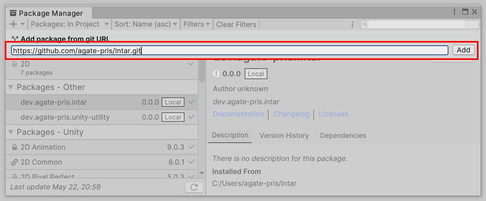
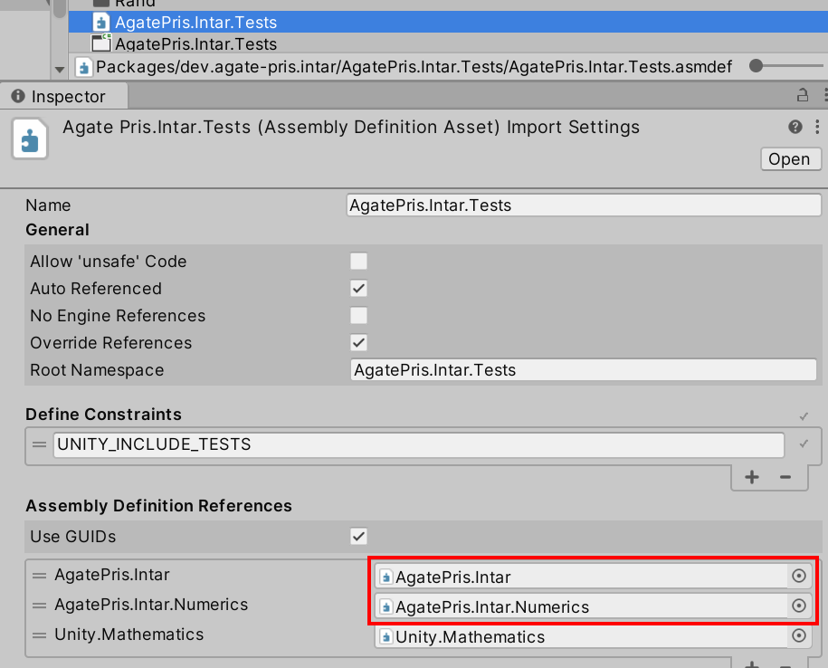

# クイックスタート

[Unity Package Manager](https://docs.unity3d.com/ja/2021.3/Manual/upm-ui.html) から [このリポジトリ](https://github.com/agate-pris/intar.git) を参照するだけでセットアップが完了します｡

他のアセンブリから使う場合は、アセンブリディフィニションに参照を追加してください｡

> [!NOTE]
> [NuGet パッケージ マネージャー](https://www.nuget.org/) には対応 **していません** ｡
